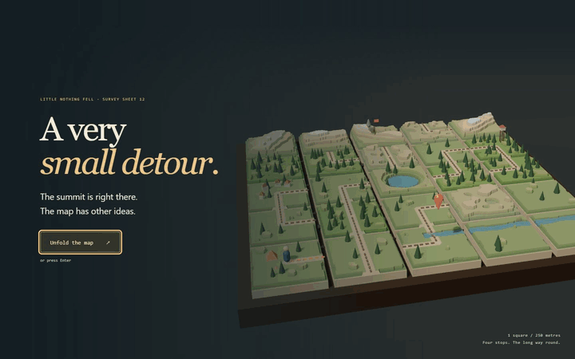
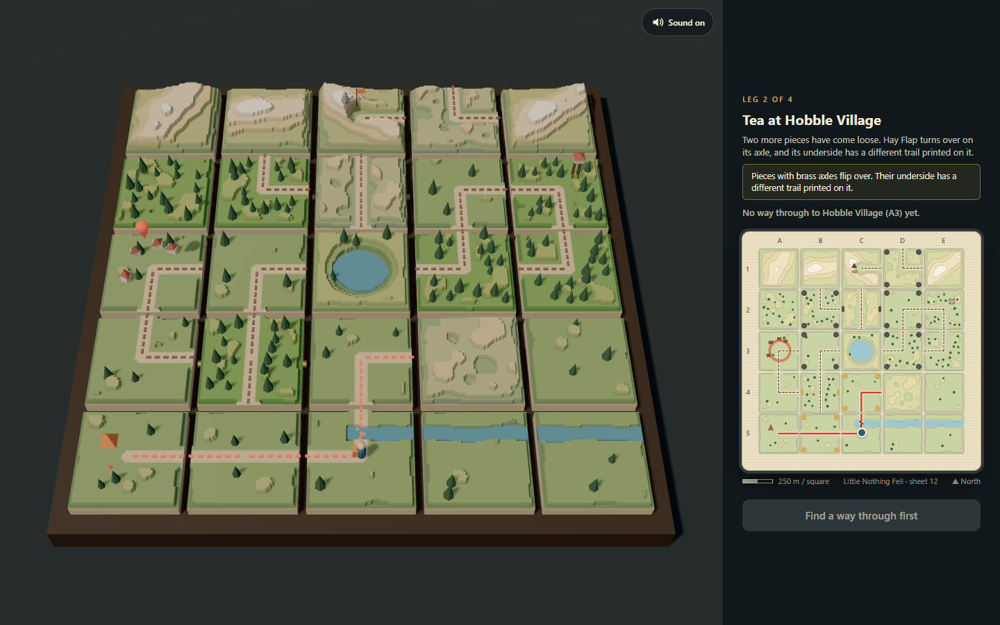
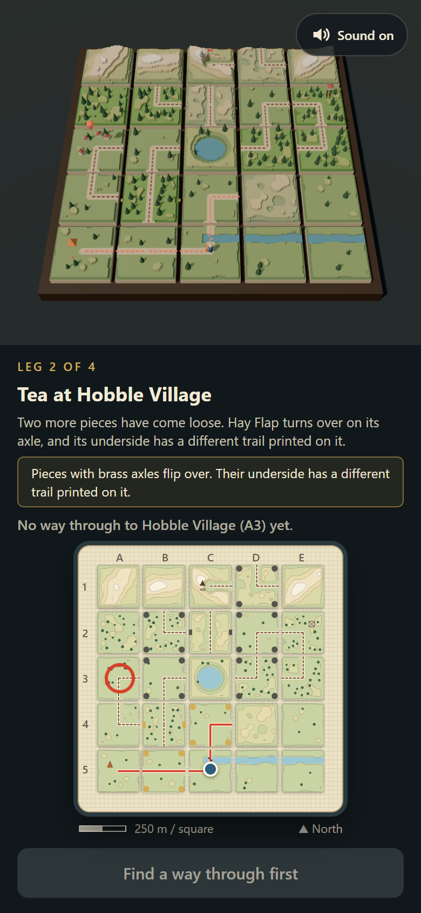

<p align="center"></p>

<p align="center">
  <a href="https://12-a-very-small-detour.williamking.workers.dev"></a>
  
  
  
  
  
  
</p>

**A route puzzle on a hinged pocket map.** A traveller crosses Little Nothing Fell over four legs. The paper map and the miniature relief model show the same state: turn or flip a hinged piece and both move, and the walkable trail re-lights at once.

<p align="center"></p>

## How to play

- The traveller's destination is a vermilion pin on the model and a ring on the map.
- **Turn pieces** (brass rivets at the corners) rotate a quarter turn clockwise. **Flip pieces** (brass axles on their sides) turn over to a different printed trail and terrain. Iron rivets or axles mean the hinge is still pinned; hinges come loose leg by leg.
- A trail connects when two neighbouring pieces both print a trail end on their shared edge. Every square the traveller can reach lights up in vermilion.
- When the route reaches the destination, press **Set off along the trail**. The traveller walks it and the next leg begins.

| Input | Keys and gestures |
| --- | --- |
| Turn or flip a piece | Click or tap it on the map or the model |
| Move between pieces | `Tab` to the map, then the arrow keys |
| Turn or flip the focused piece | `Enter` or `Space` |
| Mute (remembered) | Sound button or `M` |

## What's inside

- **Four authored legs:** the ford, the village, round the tarn to the fire tower, and up to the summit, then an ending card and replay.
- **One state, two views:** the pocket map and the terraced relief model are drawn from the same game state and one shared heightfield.
- **Solver-proven legs:** a breadth-first solver in the tests proves every leg starts closed, can be solved, and that the full journey reaches the summit.
- **A tactile model:** terraced pieces, brass and iron hinge hardware, props and a tiny traveller.
- **An unfolding journey:** the title camera surveys the terrain before settling into play, with an optional guide that follows your first turn, walk and flip. Skip it or replay it with `?`.
- **Sound:** a CC0 folk score, fell wind and birdsong, wooden creaks for turns, flaps for flips and footsteps for every square walked.
- **Reduced motion respected:** pieces snap instead of swinging and the walk is instant.

## Screenshots

| Desktop | Phone |
| --- | --- |
|  |  |

## Built with

Three.js for the survey model; React for the pocket map, leg card and ending; GSAP for hinge swings and the walk; TypeScript throughout; Vite and Bun for the build.

- **Trails as bitmasks:** each piece's printed trail ends are edge bitmasks, so connectivity is a fast, testable check.
- **A shared relief heightfield** keeps the paper map and the 3D model in exact agreement.

## Run it locally

```sh
bun install --frozen-lockfile
bun run dev      # http://127.0.0.1:4522/
bun run check    # tsc, Biome, bun test, production build into dist/
bun run preview  # http://127.0.0.1:4622/
bun run e2e      # all four legs, rapid input, ending/replay and touch layouts
```

`src/game/` holds the rules, map, trail bitmasks and relief heightfield; `src/scene/` the three.js survey model; `src/ui/` the React HUD; `tests/` the rule and relief tests with the solver.

## Credits

All geometry, terrain, textures and symbols are generated procedurally in code; there are no external visual assets. Type is the system font stack. Libraries: three.js, React, GSAP and Tailwind CSS.

Audio, all **CC0 1.0**, rebuilt by `tools/audio/build-audio.sh` (about 2 MB):

| File(s) in `public/audio/` | Source | Author | Licence |
| --- | --- | --- | --- |
| `turn-1..3`, `flip-1..2`, `pinned`, `set-off`, `fold` | [RPG Audio](https://kenney.nl/assets/rpg-audio) | Kenney (kenney.nl) | [CC0 1.0](https://creativecommons.org/publicdomain/zero/1.0/) |
| `settle`, `land`, `step-0..4` | [Impact Sounds](https://kenney.nl/assets/impact-sounds) | Kenney (kenney.nl) | CC0 1.0 |
| `tick`, `toggle` | [Interface Sounds](https://kenney.nl/assets/interface-sounds) | Kenney (kenney.nl) | CC0 1.0 |
| `route-open`, `arrive`, `finale` | [Music Jingles](https://kenney.nl/assets/music-jingles) | Kenney (kenney.nl) | CC0 1.0 |
| `music` | [Northumberland](https://opengameart.org/content/northumberland) | Spring Spring | CC0 1.0 |
| `wind`, `birds` (excerpts looped) | [Park ambiences](https://opengameart.org/content/park-ambiences) | Thimras | CC0 1.0 |

---

<p align="center"><sub>Part of William King's portfolio collection.</sub></p>
