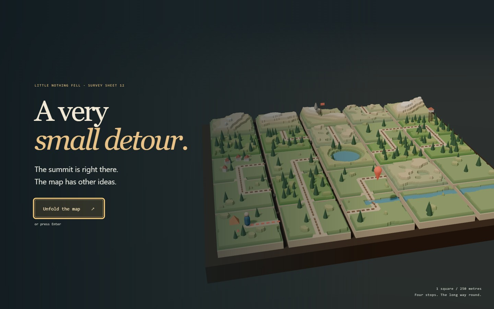
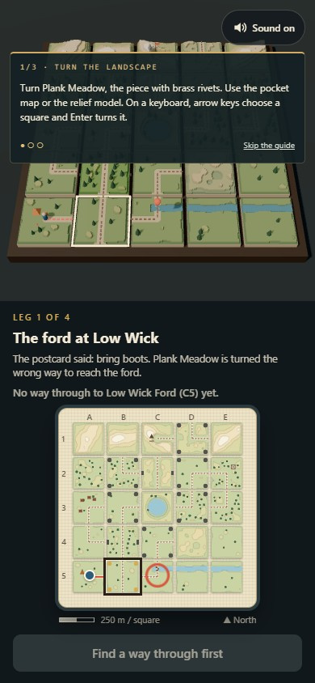
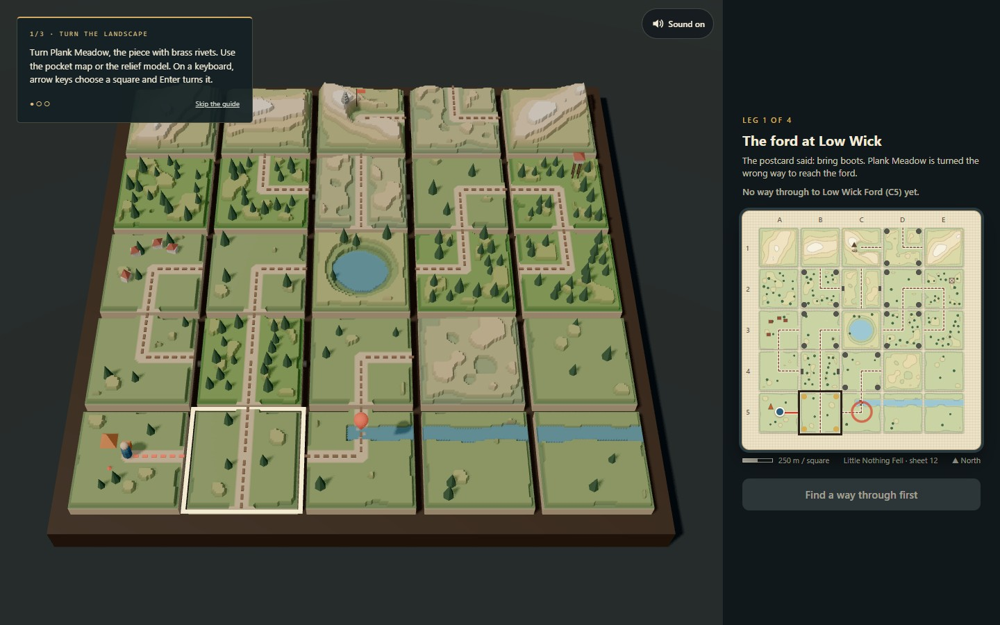

# A VERY SMALL DETOUR

<p align="center"></p>

A hinged pocket map and a miniature landscape share one route puzzle. Turn or flip the pieces until the printed trail connects, then let the traveller walk the route you made. Four legs cross Little Nothing Fell from the ford to the summit.

**[Unfold the map →](https://12-a-very-small-detour.williamking.workers.dev)** · [Run locally](#run-locally) · [Credits](#credits)

<p align="center"></p>

## Read a route, then change the ground

Choose **Unfold the map** to move from the survey-camera opening into play. The guide follows your first turn, first walk and first flip; skip it or replay it from help.

1. Find the traveller and destination, shown on both the paper map and relief model.
2. Turn a piece with a brass corner rivet, or flip one with a brass side axle. Iron hardware marks a hinge that has not unlocked yet.
3. Match trail ends across neighbouring edges. Reachable squares light in vermilion, so the map shows the connectivity the walker will actually use.
4. When the destination connects, choose **Set off along the trail**. The traveller walks the route and the next leg opens new possibilities.

| Action | Keyboard | Pointer or touch |
| --- | --- | --- |
| Choose a map piece | Tab to the map, then arrows | Point at the paper map or model |
| Turn or flip | Enter or Space on the focused piece | Click or tap the piece |
| Walk the open route | Tab to Set off, then Enter | Set off along the trail |
| Toggle sound | M | Sound |

## Four legs, one consistent model

Cross the ford, reach the village, work around the tarn to the fire tower and finish at the summit. The ending records the journey and supports a fresh replay. Brass and iron hinges, terraced terrain, small props and the traveller make each operation visible in both representations.

The map and model use the same state and relief heightfield. Edge bitmasks determine connectivity; a breadth-first solver searches valid configurations. Input is guarded while pieces move or the traveller departs, so rapid taps cannot start overlapping walks or advance a leg twice. Reduced motion snaps hinges and resolves travel immediately, including when the preference changes during a movement.

## Verification and source

Application revision `b2d3cd1` passed **34 tests / 934 assertions** and an independent **81,956-arrangement** check. Four RTX 2060 scenarios cover all four legs and 17 hinges, rapid operations, live motion changes, ending/replay and two touch sizes. See the [intro and audit report](docs/visual/INTRO-2026-09-30.md).

[src/game/](src/game/) contains the map, bitmask rules and heightfield; [src/scene/](src/scene/) contains the survey model; [src/ui/](src/ui/) contains the pocket map and journey cards; [tests/](tests/) contains rule and solver checks. Geometry, terrain and symbols are procedural; the CC0 soundtrack and foley are credited below.

## Current screenshots

| Desktop | Phone |
| --- | --- |
|  |  |



The opening loop and three main screenshots were captured from the live site on **1 October 2026**, using Chrome on this workstation; the phone image is a 390 × 844 browser viewport. The animated preview is a short loop, not a full playthrough. [Capture details](docs/readme/capture.json).

## Run locally

Use **Bun 1.3.10** (the version pinned in `package.json`) and Node.js 22.12 or newer. From this repository:

```sh
bun install --frozen-lockfile
bun run dev      # http://127.0.0.1:4522/
bun run check    # strict types, Biome, unit tests and production build
bun run preview  # http://127.0.0.1:4622/ after the build
```

Development and preview are separate long-running commands; run one at a time or use separate terminals. `bun run build` writes the static production output to `dist/`. Dependencies and the lockfile are local to this project.

### Browser suite

Install the test browser once, then run the checked-in Playwright suite. Its configuration builds and starts the production preview. Browser scenarios are separate from `bun run check`.

```sh
bunx playwright install chromium
bun run e2e
```

The recorded real-GPU release checks used installed Chrome on an RTX 2060; the default Chromium configuration is not a claim of physical-phone coverage.

## Stack and release

Direct Three.js 0.186 · React 19.3 · strict TypeScript · Vite 8.3 · GSAP 3.15 · Tailwind CSS 4.3 · Bun 1.3.10 · Biome. The public website is served by Cloudflare Workers. This README describes [application revision b2d3cd1](https://github.com/WilliamHenryKing/12-a-very-small-detour/commit/b2d3cd1002165ed945da56d6f0728f82deb1a963); the documentation refresh changes no application behaviour.

## Credits

All geometry, terrain, textures and symbols are generated procedurally in code; there are no external visual assets. Type is the system font stack. Libraries: three.js, React, GSAP and Tailwind CSS.

Audio, all **CC0 1.0**, rebuilt by `tools/audio/build-audio.sh` (about 2 MB):

| File(s) in `public/audio/` | Source | Author | Licence |
| --- | --- | --- | --- |
| `turn-1..3`, `flip-1..2`, `pinned`, `set-off`, `fold` | [RPG Audio](https://kenney.nl/assets/rpg-audio) | Kenney (kenney.nl) | [CC0 1.0](https://creativecommons.org/publicdomain/zero/1.0/) |
| `settle`, `land`, `step-0..4` | [Impact Sounds](https://kenney.nl/assets/impact-sounds) | Kenney (kenney.nl) | CC0 1.0 |
| `tick`, `toggle` | [Interface Sounds](https://kenney.nl/assets/interface-sounds) | Kenney (kenney.nl) | CC0 1.0 |
| `route-open`, `arrive`, `finale` | [Music Jingles](https://kenney.nl/assets/music-jingles) | Kenney (kenney.nl) | CC0 1.0 |
| `music` | [Northumberland](https://opengameart.org/content/northumberland) | Spring Spring | CC0 1.0 |
| `wind`, `birds` (excerpts looped) | [Park ambiences](https://opengameart.org/content/park-ambiences) | Thimras | CC0 1.0 |

---

Part of [William King's portfolio collection](https://github.com/WilliamHenryKing).
